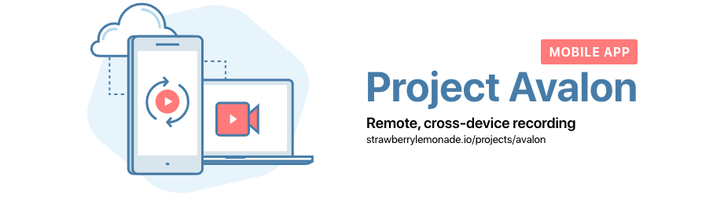

🎥 iOS client for Avalon: Remote, cross-device recording designed for client light, simple screen, video and audio recording without prior knowledge of video creation.

Other codebases under this project:
* [**Avalon API**](https://github.com/strawberrylemonade/avalon-api) - The main API of Avalon which handles all of the session management & session syncing.
* [**Avalon Transcoding Server**](https://github.com/strawberrylemonade/avalon-transcoder) - A job queue based processing of video elements.
* [**Avalon Web App**](https://github.com/strawberrylemonade/avalon-web) - Web client for Avalon, primarily for screen recording and session management.

---

